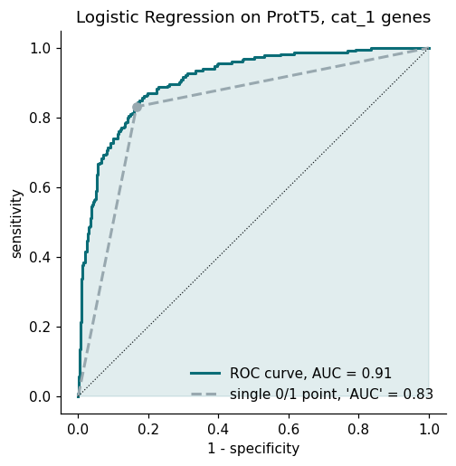
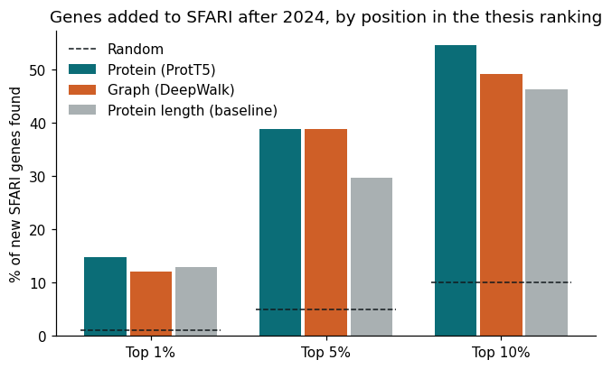
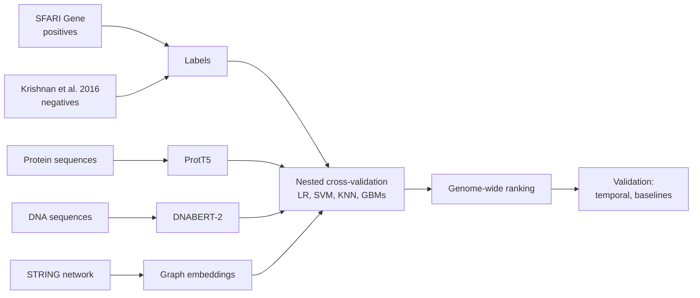

# ASD Gene Predict

[](https://github.com/joao-ps-inacio/Asd_gene_predict/actions/workflows/ci.yml)


Ranking human genes by their likelihood of being autism (ASD) risk genes, using embeddings from a protein language model (ProtT5), a DNA language model (DNABERT-2) and the STRING protein-interaction network.

This repository is a clean, reproducible rewrite of my MSc thesis, *Predicting Autism Risk Genes Using Graph and Sequence Embeddings* (Faculdade de Ciências da Universidade de Lisboa / Instituto Nacional de Saúde Doutor Ricardo Jorge, 2025). The original thesis code is kept unchanged at [a59490/Tese_ASD_Gene_Pred](https://github.com/a59490/Tese_ASD_Gene_Pred).

**Try it:** [`notebooks/demo.ipynb`](notebooks/demo.ipynb) runs the main analysis end to end on a laptop in a few minutes, without a GPU.

## Key results

**1. The thesis under-reported its own model.** The thesis computed ROC-AUC on hard 0/1 predictions, which keeps a single point of the ROC curve. Re-running the same data through the new pipeline reproduces the published numbers almost exactly. Computing the metrics on predicted probabilities instead:

| ProtT5 + Logistic Regression, test on SFARI category 1 genes | Thesis | This repo |
|---|---:|---:|
| ROC-AUC | 0.83 | **0.91** |
| Average precision (random = 0.23) | 0.53 | **0.77** |

**2. The thesis ranking anticipated genes that SFARI added two years later.** The model was trained on the January 2024 SFARI release. Of the 127 genes SFARI added by July 2026, **55% were already in the top 10%** of ~16,000 unlabelled genes (random: 10%, p < 10⁻³⁰). Seven of the top 50 candidates were later added to SFARI (CHD4, BPTF, DOP1A, DOT1L, FRYL, RALGAPA1, ZNF532).

**3. The signal is not just gene size.** Long genes are discovered more often, and ranking by protein length alone already gives AUC 0.79. The protein-embedding ranking beats it: +0.05 AUC (95% CI 0.01–0.10), and keeps AUC 0.80 among genes of similar length.

<p>
  
  
</p>

Detailed reports (in Portuguese): [reproduction of the thesis results](reports/reproducao_prott5.md) · [temporal validation](reports/validacao_temporal.md).

## Approach



- **Labels.** Positives are SFARI Gene genes. Several sets were compared (category 1 only, up to category 3, with or without syndromic genes). Negatives are the genes listed by Krishnan et al. (2016) that are not in SFARI.
- **Evaluation.** Stratified 5-fold cross-validation defined on the highest-confidence genes (category 1). Every model is tested on the same genes, and larger positive sets only add training data. Hyperparameters are tuned inside each training fold, so no information leaks into the test fold.
- **Metrics.** ROC-AUC and average precision on probabilities, precision among the top-k genes, and MCC. The thesis-style values are kept for comparison.
- **Temporal validation.** Rankings built with an older SFARI release are scored against the genes SFARI added later, and compared with simple baselines on the same genes.

## Data

| Source | Use | Version |
|---|---|---|
| [SFARI Gene](https://gene.sfari.org/) | positive genes | releases of 2024-01-16 and 2026-07-12 |
| Krishnan et al., *Nat Neurosci* 2016 | negative genes | — |
| [STRING](https://string-db.org/) | protein-interaction graph | v12.0 in the new pipeline |
| HGNC, MANE | gene identifier map | current / v1.4 |
| ProtT5 embeddings | protein features | computed in the thesis |

Every source is declared in [`configs/sources.yaml`](configs/sources.yaml). `asd fetch` downloads it and checks its SHA-256 against [`configs/sources.lock.yaml`](configs/sources.lock.yaml), so a silently changed upstream file is detected instead of used. Data files never go into Git.

## Quickstart

```bash
git clone https://github.com/joao-ps-inacio/Asd_gene_predict.git
cd Asd_gene_predict
python -m venv .venv && source .venv/bin/activate
pip install -e ".[dev]"

asd fetch --stage labels && asd fetch legacy_prott5   # download and verify inputs
asd labels                                            # build positive/negative labels
asd embed protein --legacy                            # load the thesis ProtT5 embeddings
asd train --features protein_prott5 --model lr --set cat_1
```

`asd --help` lists every command. Temporal validation also needs the current SFARI "Human Gene" CSV, downloaded by hand from [gene.sfari.org/tools](https://gene.sfari.org/tools/) (SFARI terms of use), followed by `asd validate-temporal`.

## Engineering

- One command-line pipeline (`asd`) replacing three near-identical training scripts and several notebooks.
- Versioned, checksummed inputs; parameters in YAML; fixed random seeds.
- Embeddings and tables stored as Parquet, not as vectors serialised into CSV text.
- Tests on small fixtures that run offline, plus lint (ruff) on every pull request through GitHub Actions.
- Bugs found in the original code are listed and fixed in [`CLAUDE.md`](CLAUDE.md), including the AUC computation and an XGBoost class-weight parameter that was silently ignored.

## Repository layout

```
configs/      pipeline parameters, data sources and checksums
notebooks/    end-to-end demo
reports/      result reports and figures
scripts/      report generation
src/asd_gene_predict/
  data/         sources, gene identifier map, labels
  embeddings/   embedding storage and import
  models/       model registry, cross-validation and metrics
  validation/   temporal validation and baselines
tests/
```

## Roadmap

- Add gene-constraint (gnomAD LOEUF) and network-degree baselines.
- Regenerate DNA and graph embeddings with the new pipeline and compare all sources with correct metrics.
- Publish a genome-wide ranking with a small web app to look up any gene.

## Disclaimer

This is a research project. Scores rank genes for further study; they are not a diagnostic tool.

## Author

João Inácio — AI engineer, MSc in Bioinformatics and Computational Biology (FCUL).
