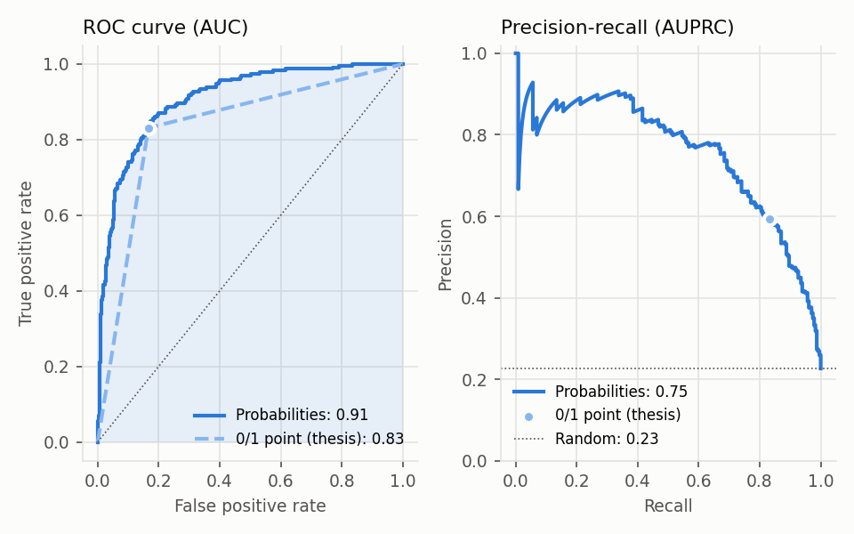
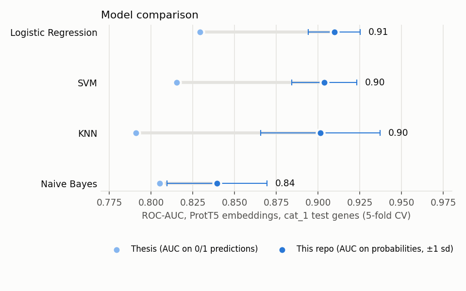
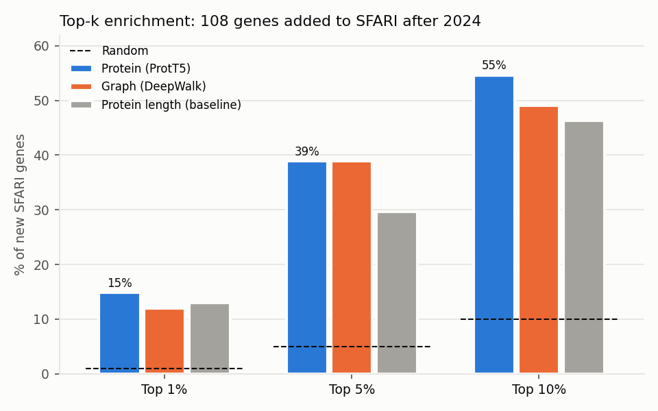
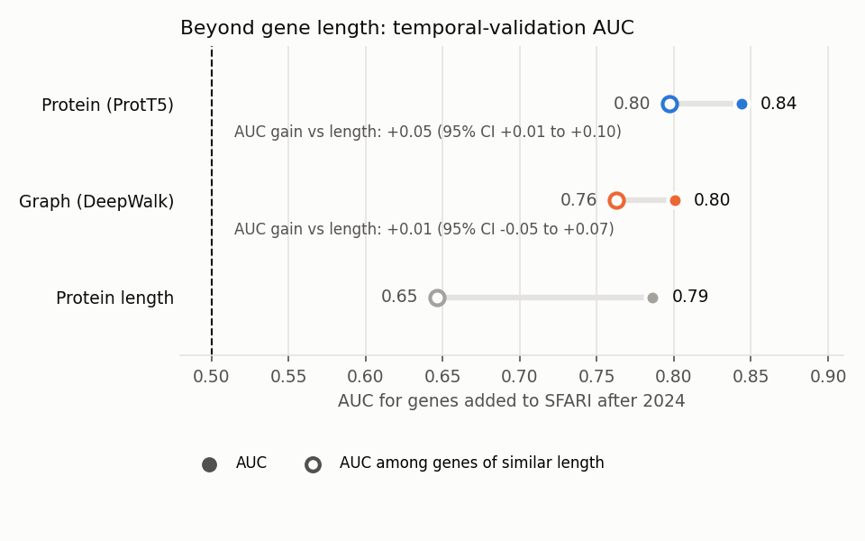
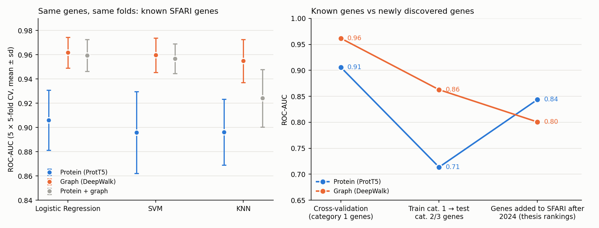
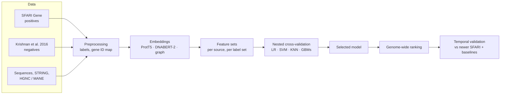

# ASD Gene Predict

[](https://github.com/joao-ps-inacio/Asd_gene_predict/actions/workflows/ci.yml)


Machine-learning pipeline that ranks human genes by their likelihood of being autism (ASD) risk genes. A reproducible rewrite of my MSc thesis.

| | |
|---|---|
| **What** | Rank ~19,000 human genes by autism risk, using SFARI Gene as ground truth |
| **How** | Protein language-model embeddings (ProtT5); DNA (DNABERT-2) and protein-interaction graph embeddings from the thesis; classical classifiers with nested cross-validation |
| **Result** | ROC-AUC **0.91** on held-out high-confidence genes. **55%** of the genes SFARI added two years later were already in the model's top 10% |
| **Why it matters** | Narrows thousands of genes to a short list of candidates for follow-up studies, the same ranking problem as target prioritisation |
| **Run it** | [`notebooks/demo.ipynb`](notebooks/demo.ipynb) on a laptop, no GPU, or `pip install -e .` then `asd --help` |

## Results

<table>
  <tr>
    <td width="50%"></td>
    <td width="50%"></td>
  </tr>
  <tr>
    <td><b>Corrected evaluation.</b> The thesis computed ROC-AUC on 0/1 predictions, which keeps one point of the curve. On probabilities, ROC-AUC is 0.91 instead of 0.83.</td>
    <td><b>Model comparison.</b> The new pipeline reproduces the thesis values, then corrects them. Linear models, SVM and KNN perform alike; the signal is in the embeddings.</td>
  </tr>
  <tr>
    <td></td>
    <td></td>
  </tr>
  <tr>
    <td><b>Temporal validation.</b> Trained on SFARI as of January 2024; 15% of the genes added by July 2026 were in the top 1% of ~16,000 unlabelled genes (15× random).</td>
    <td><b>Beyond gene length.</b> Long genes are discovered more often. The protein ranking still beats a length-only baseline (+0.05 AUC, 95% CI 0.01 to 0.10).</td>
  </tr>
</table>

Seven of the top 50 candidates in the thesis ranking were later added to SFARI: CHD4, BPTF, DOP1A, DOT1L, FRYL, RALGAPA1 and ZNF532.

**Protein vs graph embeddings.** Compared on the same genes, folds and models, graph embeddings recover known SFARI genes better (ROC-AUC 0.96 vs 0.91, paired corrected t-test p < 0.001). On genes discovered after 2024 the order reverses: the protein ranking does at least as well, and only it beats the gene-length baseline. Graph embeddings appear to capture how well a gene is already characterised in the interaction network. [Full comparison](reports/embedding_comparison.md).



Full reports: [reproduction of the thesis results](reports/prott5_reproduction.md) · [temporal validation](reports/temporal_validation.md) · [protein vs graph](reports/embedding_comparison.md) · [changes from the thesis code](docs/changes_from_thesis.md)

## Pipeline



- **Labels.** Positives are SFARI Gene genes; several sets are compared (category 1 only, up to category 3, with or without syndromic genes). Negatives are the Krishnan et al. (2016) genes not in SFARI.
- **Evaluation.** Stratified 5-fold cross-validation on the highest-confidence genes (category 1). Every model is tested on the same genes, and larger positive sets only add training data. Hyperparameters are tuned inside each training fold.
- **Metrics.** ROC-AUC and average precision on probabilities, precision among the top-k genes, and MCC.
- **Temporal validation.** A ranking built with an older SFARI release is scored against the genes SFARI added later, and compared with baselines on the same genes.

## Engineering highlights

| | |
|---|---|
| **Reproducible ML pipeline** | Same inputs, same outputs: pinned data versions, fixed seeds, results written to Parquet |
| **CLI** | One entry point (`asd fetch`, `labels`, `embed`, `train`, `validate-temporal`) replacing three duplicated scripts and ad-hoc notebooks |
| **Configuration-driven experiments** | Label sets, CV settings and models defined in [`configs/default.yaml`](configs/default.yaml), not in code |
| **Data versioning and checksums** | Every input declared in [`configs/sources.yaml`](configs/sources.yaml); SHA-256 locked in [`sources.lock.yaml`](configs/sources.lock.yaml), so a changed upstream file fails loudly |
| **Nested cross-validation** | Hyperparameter search inside each training fold, scaling inside the pipeline: no leakage into test folds |
| **Model registry** | Classifiers and their search grids in one place ([`models/registry.py`](src/asd_gene_predict/models/registry.py)) |
| **Fair model comparison** | Sources compared on identical genes and folds, with a paired corrected resampled t-test (Nadeau & Bengio) for repeated cross-validation |
| **Temporal validation** | Prospective check against a newer SFARI release, with bootstrap confidence intervals and a gene-length baseline |
| **Unit tests on offline fixtures** | 49 tests on small synthetic and sampled data; no network needed |
| **CI** | Lint (ruff) and tests on every pull request with GitHub Actions |
| **Documented fixes** | Issues found in the original code, and how each was fixed: [`docs/changes_from_thesis.md`](docs/changes_from_thesis.md) |

## Quickstart

```bash
git clone https://github.com/joao-ps-inacio/Asd_gene_predict.git
cd Asd_gene_predict
python -m venv .venv && source .venv/bin/activate
pip install -e ".[dev]"

asd fetch --stage labels && asd fetch legacy_prott5   # download and verify inputs
asd labels                                            # build positive/negative labels
asd embed protein --legacy                            # load the thesis ProtT5 embeddings
asd embed graph --legacy                              # and the thesis graph embeddings
asd train --features protein_prott5 --model lr --set cat_1
asd compare --features protein_prott5 --features graph_deepwalk --model lr
```

Temporal validation also needs the current SFARI "Human Gene" CSV, downloaded by hand from [gene.sfari.org/tools](https://gene.sfari.org/tools/) (SFARI terms of use), followed by `asd validate-temporal`. The README figures are rebuilt with `python scripts/readme_figures.py`.

## Data

| Source | Use | Version |
|---|---|---|
| [SFARI Gene](https://gene.sfari.org/) | positive genes | releases of 2024-01-16 and 2026-07-12 |
| Krishnan et al., *Nat Neurosci* 2016 | negative genes | — |
| [STRING](https://string-db.org/) | protein-interaction graph | v12.0 in the new pipeline |
| HGNC, MANE | gene identifier map | current / v1.4 |
| ProtT5 embeddings | protein features | computed in the thesis |

## Repository layout

```
configs/      pipeline parameters, data sources and checksums
docs/         changes from the thesis code, project plan
notebooks/    end-to-end demo
reports/      result reports and figures
scripts/      report and figure generation
src/asd_gene_predict/
  data/         sources, gene identifier map, labels
  embeddings/   embedding storage and import
  models/       model registry, cross-validation and metrics
  validation/   temporal validation and baselines
tests/
```

## Roadmap

- Add gene-constraint (gnomAD LOEUF) and network-degree baselines.
- Regenerate DNA and graph embeddings with the new pipeline and compare all sources with correct metrics.
- Publish a genome-wide ranking with a small web app to look up any gene.

## Related repositories

- **Portfolio version (this repository):** [joao-ps-inacio/Asd_gene_predict](https://github.com/joao-ps-inacio/Asd_gene_predict)
- **Original thesis implementation:** [Tese_ASD_Gene_Pred](https://github.com/a59490/Tese_ASD_Gene_Pred), kept unchanged

The thesis: *Predicting Autism Risk Genes Using Graph and Sequence Embeddings*, MSc in Bioinformatics and Computational Biology, Faculdade de Ciências da Universidade de Lisboa / Instituto Nacional de Saúde Doutor Ricardo Jorge, 2025.

## Disclaimer

This is a research project. Scores rank genes for further study; they are not a diagnostic tool.

## Author

João Inácio — AI engineer, MSc in Bioinformatics and Computational Biology (FCUL).
