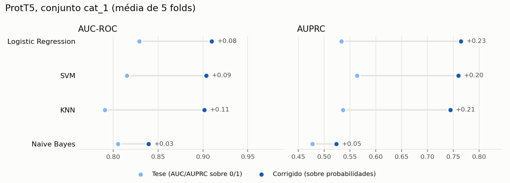

# ASD Gene Predict

Previsão de genes de risco de autismo (ASD) com machine learning sobre embeddings de **sequência de DNA** (DNABERT-2), **sequência de proteína** (ProtT5) e **grafo de interações proteína-proteína** (GRAPE).

É a reescrita do código da tese de mestrado *"Predicting Autism Risk Genes Using Graph and Sequence Embeddings"* (FCUL / INSA, 2025). O repositório original está em [a59490/Tese_ASD_Gene_Pred](https://github.com/a59490/Tese_ASD_Gene_Pred).

## Pipeline

```
SFARI + Krishnan ──► labels ──┐
Ensembl FASTA ──► DNABERT-2 / ProtT5 ──┼──► dataset ──► CV + modelos ──► lista ordenada ──► validação
STRING PPI ──► GRAPE ──────────────────┘
```

1. **Labels**: positivos do SFARI Gene (várias combinações de categorias), negativos de Krishnan et al. (2016)
2. **Embeddings**: um vetor por gene para cada fonte (DNA, proteína, grafo)
3. **Modelos**: LR, SVM, RF, XGBoost, LightGBM, KNN, com validação cruzada estratificada
4. **Validação**: ranking de todos os genes, enriquecimento por decis e análise de rede do decil de topo

## Instalação

```bash
python -m venv .venv && source .venv/bin/activate
pip install -e ".[dev]"            # núcleo + ferramentas de desenvolvimento
pip install -e ".[seq]"            # para gerar embeddings de sequência (GPU recomendada)
pip install -e ".[graph]"          # para gerar embeddings de grafo
pytest
```

## Resultados

Com as métricas corrigidas, os embeddings ProtT5 dão AUC ~0,91 e AUPRC ~0,76 no teste `cat_1`. A tese reportava AUC 0,83 e AUPRC 0,53. Ver [reports/reproducao_prott5.md](reports/reproducao_prott5.md).



## Utilização

```bash
asd fetch                  # 0. descarregar e verificar os dados brutos (configs/sources.yaml)
asd gene-map               #    tabela de IDs Ensembl ↔ HGNC ↔ Entrez ↔ MANE ↔ STRING
asd labels                 # 1. construir positivos/negativos
asd embed protein          # 2. gerar embeddings (dna | protein | graph)
asd train --features protein_prott5 --model lr   # 3. treinar e avaliar
asd rank                   # 4. lista ordenada de genes
```

> Estado: em construção. `fetch`, `gene-map`, `labels`, `train` e `embed protein --legacy` já funcionam; `rank` e a geração de embeddings novos ainda não (ver `CLAUDE.md`).

## Estrutura

```
configs/        configuração YAML do pipeline
data/           dados (fora do Git, ver data/README.md)
notebooks/      exploração e figuras
reports/        resultados e figuras finais
scripts/        scripts auxiliares (ex.: jobs de cluster)
src/asd_gene_predict/
  data/         labels e construção de datasets
  embeddings/   DNABERT-2, ProtT5, GRAPE
  models/       treino e avaliação
  validation/   ranking, enriquecimento, rede
tests/
```
