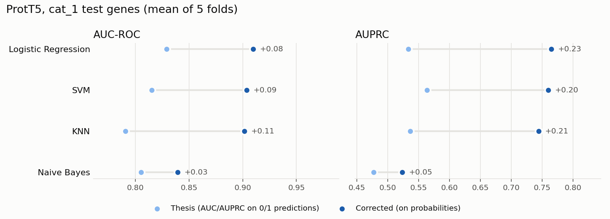

# Reproducing the thesis: ProtT5 embeddings

Goal: run the new pipeline on **the same ProtT5 embeddings and the same labels as the thesis**, and check (1) whether it reproduces the published numbers and (2) how much they change when the metrics are computed correctly.



## Main result (tested on `cat_1` genes, trained on `cat_1`)

<!-- TABELA_CAT1 -->
| Model | Thesis AUC | AUC (thesis formula, new pipeline) | **Corrected AUC** | Thesis AUPRC | **Corrected AUPRC** |
|---|---:|---:|---:|---:|---:|
| Logistic Regression | 0.829 | 0.830 | **0.910** ± 0.016 | 0.533 | **0.765** ± 0.058 |
| SVM | 0.815 | 0.824 | **0.904** ± 0.019 | 0.564 | **0.760** ± 0.056 |
| KNN | 0.791 | 0.800 | **0.901** ± 0.036 | 0.537 | **0.744** ± 0.075 |
| Naive Bayes | 0.805 | 0.815 | **0.840** ± 0.030 | 0.477 | **0.523** ± 0.047 |
<!-- /TABELA_CAT1 -->

- **The new pipeline reproduces the thesis.** With the AUC computed as in the thesis (on 0/1 predictions), Logistic Regression gives 0.830; the thesis reported 0.829.
- **Computed on probabilities, performance is higher.** ROC-AUC rises to about 0.90–0.91 and average precision (AUPRC) from about 0.53 to about 0.76. The random baseline for AUPRC is the share of positives in the test set: 0.23.
- **The choice of classifier matters little.** Logistic Regression, SVM and KNN are within one standard deviation of each other, so the signal comes from the embeddings rather than the model. Naive Bayes is clearly worse.

## Adding category 2 and 3 genes to training does not help

AUPRC on the `cat_1` test genes, by the positive genes used for training:

<!-- TABELA_SETS -->
| Training positives | Logistic Regression | SVM | KNN | Naive Bayes |
|---|---:|---:|---:|---:|
| `cat_1` | 0.765 | 0.760 | 0.744 | 0.523 |
| `cat_1_sd` | 0.763 | 0.772 | 0.757 | 0.521 |
| `cat_1_2` | 0.735 | 0.743 | 0.714 | 0.449 |
| `cat_1_2_sd` | 0.743 | 0.748 | 0.700 | 0.455 |
| `cat_1_2_3` | 0.731 | 0.740 | 0.711 | 0.441 |
| `complete` | 0.737 | 0.743 | 0.725 | 0.451 |
<!-- /TABELA_SETS -->

Adding syndromic genes without a score (`_sd`) makes no difference. Adding categories 2 and 3 lowers performance slightly, consistent with their weaker evidence.

## How to reproduce

```bash
asd fetch --stage labels && asd fetch legacy_prott5
asd labels
asd embed protein --legacy
asd train --features protein_prott5 --model lr --model svm --model knn --model nb
asd train --features protein_prott5 --model rf --model lgbm --model xgb --set cat_1
python scripts/report_reproduction.py
```

## Differences from the thesis setup

The "thesis formula" column is not an exact replay of the thesis, because three other things changed:
- hyperparameters are tuned for AUPRC instead of F1;
- the hyperparameter grids are smaller;
- folds are shuffled with a fixed seed instead of following file order.

The differences are still about 0.01, which shows that the change in the results comes from the metric correction. All changes are listed in [`docs/changes_from_thesis.md`](../docs/changes_from_thesis.md).

## Limitations and next steps

- Random Forest, LightGBM and XGBoost have not been run yet: with the current grids they take hours on 2 CPUs. In the thesis, none of them beat Logistic Regression on `cat_1`. The second training command above runs them on a larger machine; then rerun the report script.
- With 5 folds, the standard deviation of AUPRC is about 0.06. Comparing models with confidence needs repeated cross-validation (`asd train --repeats 5`).
- SFARI genes are better studied than average. A baseline using only each gene's degree in the protein-interaction network would show whether the embeddings capture more than that bias.
- The same exercise is still to be done for the DNA (DNABERT-2) and graph embeddings.
