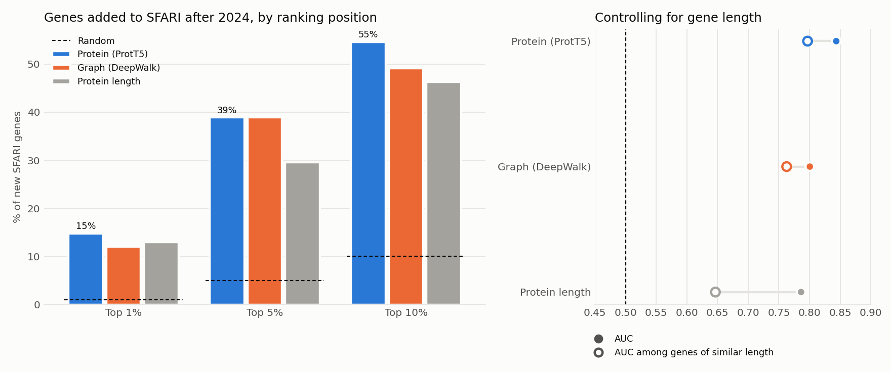

# Temporal validation: did the thesis rankings anticipate SFARI?

The thesis trained on the January 2024 SFARI release and ranked about 17,000 genes by their probability of being autism risk genes. Since then, SFARI has added **127 genes** (July 2026 release: 9 in category 1, 12 in category 2 and 106 in category 3). None of them were seen during training.

The question is simple: were those genes near the top of the ranking?



## Result

The evaluation covers the ~16,000 genes that had no label in 2024 (neither SFARI nor Krishnan negatives) and have a score in all three methods. Of these, 108 were later added to SFARI.

<!-- TABELA -->
| Score | AUC | Length-adjusted AUC | Top 1% | Top 10% | Median percentile |
|---|---:|---:|---:|---:|---:|
| Protein (ProtT5) | 0.84 | 0.80 | 15% (15×) | 55% (5.5×) | 92% |
| Graph (DeepWalk) | 0.80 | 0.76 | 12% (12×) | 49% (4.9×) | 90% |
| Protein length | 0.79 | 0.65 | 13% (13×) | 46% (4.6×) | 88% |
<!-- /TABELA -->

- **The thesis rankings anticipated the new genes.** With protein embeddings, 55% of the new genes were in the top 10% of the ranking and 15% in the top 1%, against 10% and 1% by chance. The hypergeometric p-value is below 10⁻³⁰.
- **Gene size explains part of this.** Ranking genes by protein length alone already gives AUC 0.79. Long genes accumulate more de novo variants and are discovered more often.
- **Protein embeddings add information beyond size.** The AUC difference against protein length is +0.05, with a 95% bootstrap confidence interval of [0.01, 0.10]. Among genes of similar length, the protein ranking keeps AUC 0.80, against 0.65 for length.
- **The graph ranking does not beat length significantly.** The difference is +0.01, with an interval of [−0.05, 0.07].

## Examples

- Of the top 50 candidates in the protein ranking, 7 were later added to SFARI: CHD4, BPTF, DOP1A, DOT1L, FRYL, RALGAPA1 and ZNF532.
- The thesis highlighted 12 new candidates from the graph ranking. Two of them, **RALGAPA1 and NPAS3**, were later added to SFARI.
- Four genes moved from category 2 to category 1 (CAMK2A, KCNQ2, SATB2, TRRAP). The three that have a score were already near the top of the ranking.

## Limitations

- 106 of the 127 new genes are category 3, the weakest evidence level. For the 9 category 1 genes the result is mixed.
- Three new category 1 genes are RNAs (RNU4-2, RNU2-2, RNU5B-1). They have no protein and no network node, so none of these methods can score them.
- The gene-constraint baseline (gnomAD LOEUF), the most demanding one, is still missing. The command already includes it when the file is in `data/raw` (`asd fetch gnomad_constraint`).
- The rankings are the ones produced in the thesis, with the original model. Its metrics were miscomputed, but the order of the genes does not depend on that.

## How to reproduce

```bash
asd fetch --stage labels && asd fetch --stage validation   # the recent SFARI release is a manual download
asd validate-temporal
python scripts/report_temporal.py
```
