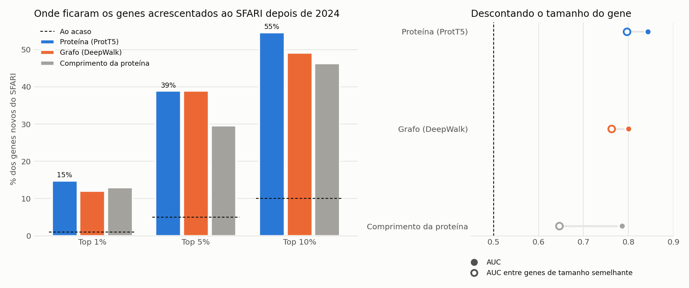

# Validação temporal: os rankings da tese anteciparam o SFARI?

A tese treinou com o SFARI de janeiro de 2024 e ordenou ~17 mil genes por probabilidade de serem genes de risco de autismo. Desde então, o SFARI acrescentou **127 genes** (release de julho de 2026: 9 de categoria 1, 12 de categoria 2 e 106 de categoria 3). Nenhum deles foi visto no treino.

A pergunta é simples: esses genes estavam no topo da lista?



## Resultado

Foram avaliados os ~16 mil genes que não tinham label em 2024 (nem SFARI, nem negativos do Krishnan) e que têm score nos três métodos. Destes, 108 entraram depois no SFARI.

<!-- TABELA -->
| Score | AUC | AUC (ajustada ao comprimento) | Top 1% | Top 10% | Percentil mediano |
|---|---:|---:|---:|---:|---:|
| Proteína (ProtT5) | 0.84 | 0.80 | 15% (15×) | 55% (5.5×) | 92% |
| Grafo (DeepWalk) | 0.80 | 0.76 | 12% (12×) | 49% (4.9×) | 90% |
| Comprimento da proteína | 0.79 | 0.65 | 13% (13×) | 46% (4.6×) | 88% |
<!-- /TABELA -->

- **Os rankings da tese anteciparam os genes novos.** Com proteína, 55% dos genes novos estavam no top 10% da lista e 15% no top 1%. Ao acaso seriam 10% e 1%. O p-valor (hipergeométrico) é < 10⁻³⁰.
- **O tamanho do gene explica parte disto.** Um "modelo" que só ordena os genes pelo comprimento da proteína já tem AUC 0,79. Os genes longos acumulam mais mutações de novo e por isso são descobertos mais vezes.
- **A proteína acrescenta informação para lá do tamanho.** A diferença de AUC face ao comprimento é +0,05, com intervalo de confiança a 95% de [0,01; 0,10]. Entre genes de tamanho semelhante, a proteína mantém AUC 0,80, contra 0,65 do comprimento.
- **O grafo não ganha ao comprimento de forma significativa.** A diferença é +0,01, com intervalo de [−0,05; 0,07].

## Exemplos

- Dos 50 primeiros candidatos do ranking de proteína, 7 entraram depois no SFARI: CHD4, BPTF, DOP1A, DOT1L, FRYL, RALGAPA1 e ZNF532.
- A tese destacou 12 candidatos do ranking de grafo (tabela de genes novos). Dois deles, **RALGAPA1 e NPAS3**, entraram depois no SFARI.
- Quatro genes passaram da categoria 2 para a 1 (CAMK2A, KCNQ2, SATB2, TRRAP). Os três com score já estavam perto do topo do ranking.

## Limitações

- 106 dos 127 genes novos são de categoria 3, a de evidência mais fraca. Nos 9 de categoria 1 o resultado é misto.
- Três genes novos de categoria 1 são RNAs (RNU4-2, RNU2-2, RNU5B-1). Não têm proteína nem nó na rede, por isso nenhum dos métodos os consegue prever.
- Falta o baseline de restrição genética (LOEUF, gnomAD), que é o mais exigente. O comando já o inclui quando o ficheiro está em `data/raw` (`asd fetch gnomad_constraint`).
- Os rankings são os da tese, gerados com o modelo antigo. As métricas desse modelo estavam mal calculadas, mas a ordenação dos genes não depende disso.

## Como reproduzir

```bash
asd fetch --stage labels && asd fetch --stage validation   # o SFARI recente é manual
asd validate-temporal
python scripts/report_temporal.py
```
